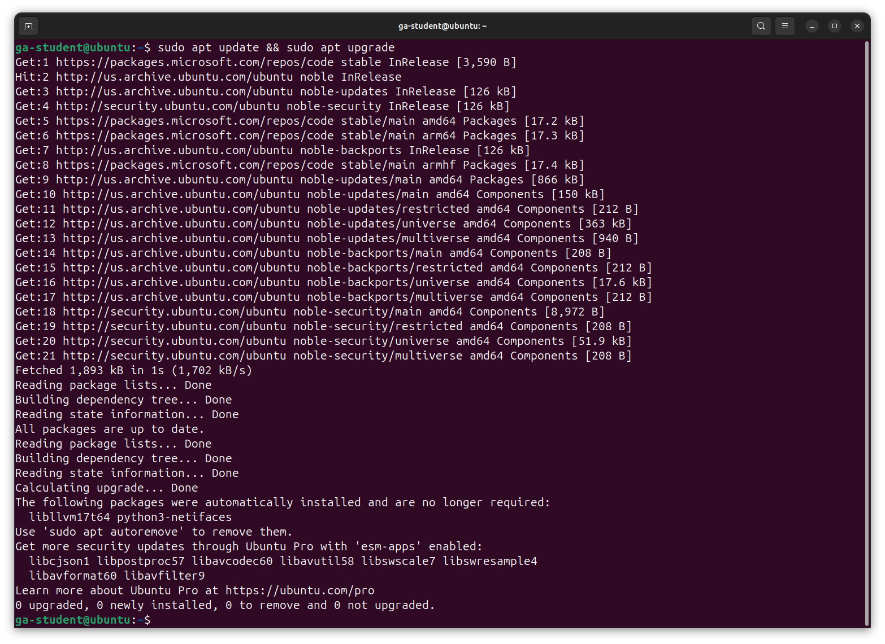
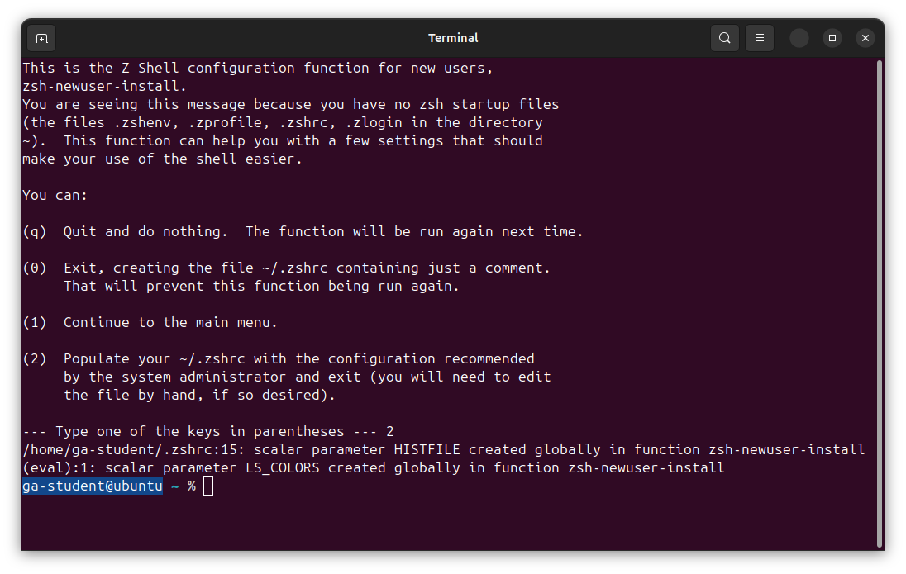
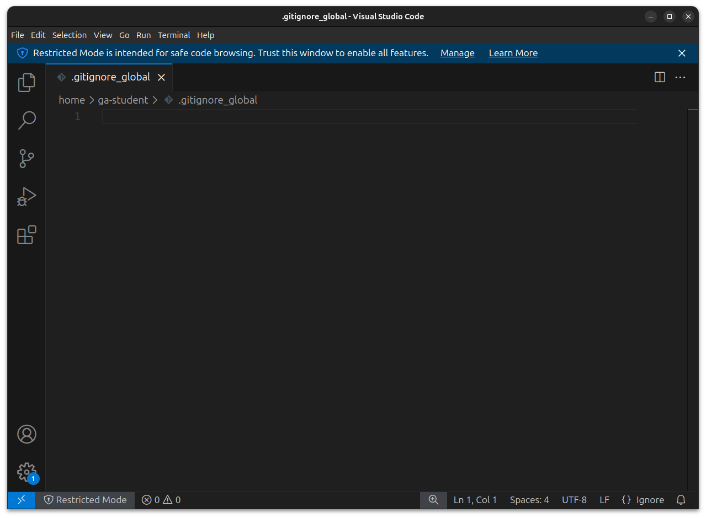
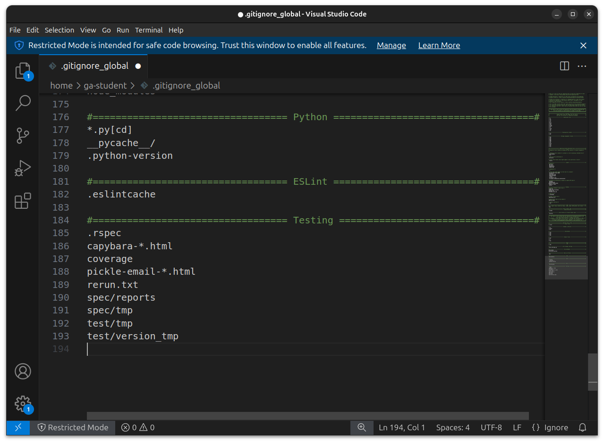
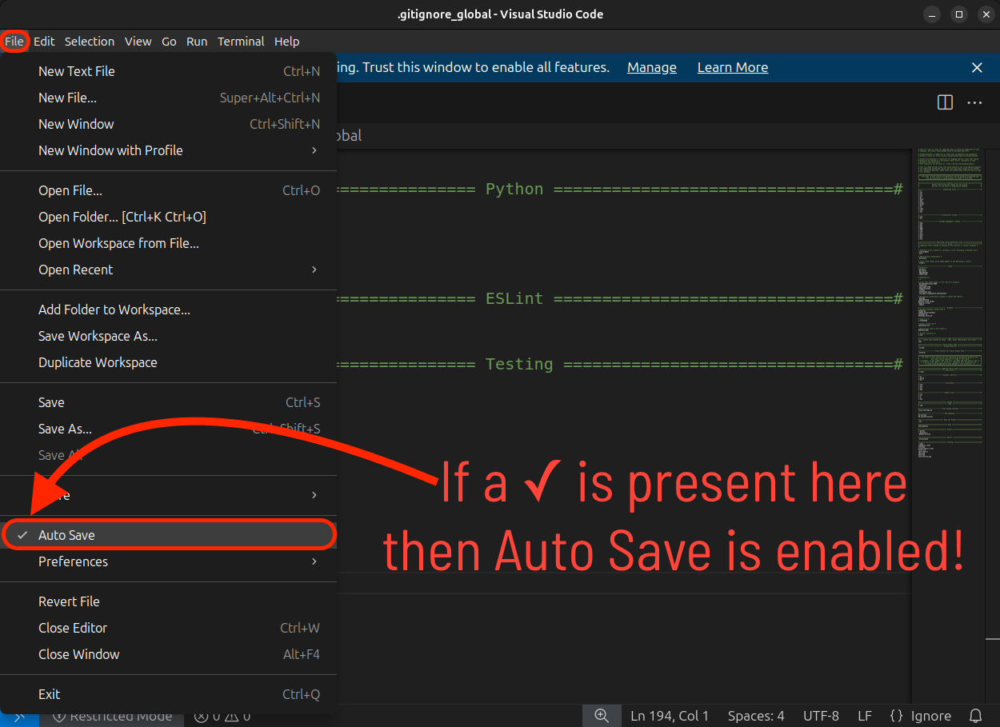
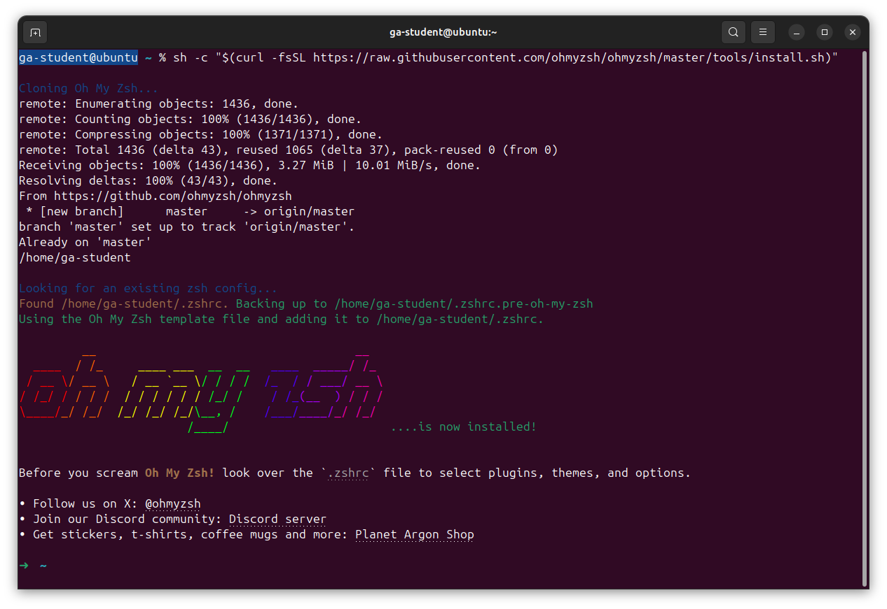

<h1>
  <span class="headline">ITB Installfest Early 2025</span>
  <span class="subhead">Ubuntu</span>
</h1>

Please only proceed with this guide if you cannot use Windows or macOS. While taking the course on Linux is more than possible, many course tools we use, such as Zoom, perform better on Windows or macOS. Proceed at your own risk.

## What you need to begin *(you must read this, do not skip this, this is important)*

- ***A device running Ubuntu 24.04 LTS (Noble Numbat).***
- At least 40GB of free hard drive space.
- At least 8GB of RAM. 16GB of RAM or more is preferable and will improve your learning experience (particularly when screen sharing in Zoom).
- A user account with administrative privilege to your local installation of Ubuntu.
- A fundamental understanding of Linux system administration and debugging.

## Troubleshooting

If you run into issues during Installfest, please reach out to your Installfest point of contact.

## Slack

We will be using Slack to communicate throughout the course. Download the `.deb` app from Slack [here](https://slack.com/downloads/) and install it. Please do not use the in-browser version of Slack, as it makes managing notifications unnecessarily difficult and makes it easy to miss important class information - the app is the way to go.

We also recommend downloading the Slack app for your mobile device to stay in touch on the go - you can find quick QR code links inside the toggles below. You won't need this often, but it can be handy in emergencies.

<details>
<summary>Slack - iOS</summary>

Scan this QR code with your iOS device to get the Slack app from the App Store.


</details>

<details>
<summary>Slack - Android (Google Play)</summary>

Scan this QR code with your Android device to get the Slack app from the Google Play Store.


</details>

## Zoom

We'll hold class in Zoom. If you haven't already, download the Zoom client from [here](https://zoom.us/download#client_4meeting) and install it.

## Visual Studio Code

We will use VS Code as our code editor in class. Download and install the `.deb` package for VS Code [here](https://code.visualstudio.com/).

## A note on copying commands

When possible, ***please copy the commands from this page***. You will use most of the commands here once and never again. Typing them out will only introduce the possibility of you making errors. Certain commands will require you to alter portions of them - this is specifically called out when they appear. There are no bonus points for doing work already done for you.

### Copying text in code blocks

To copy text from code blocks, use your mouse to hover over the code block. A **Copy** button will appear in the upper right corner. Click this, and the text held in the code block will be put on your clipboard, ready to be pasted. By default, you'll need to use <kbd>Ctrl</kbd> + <kbd>Shift</kbd> + <kbd>V</kbd> to paste into the Ubuntu terminal.


## Launch the Terminal application

To quickly launch applications, press the <kbd>Super</kbd> key (this is the name of the <kbd>Windows</kbd> key on your keyboard in Ubuntu) to launch System Search view and type `Terminal`. Select the Terminal application by pressing <kbd>Enter</kbd> when it appears. Get used to doing this often; it's the fastest way to start applications on Ubuntu!


The Terminal application should start!

## Updating and upgrading packages

Your Linux installation will not automatically perform updates, so run this command now to update manually:

```bash
sudo apt update && sudo apt upgrade
```

To run a command, paste (or type) it into your terminal, confirm it matches what you intended, and press the <kbd>Enter</kbd> key.

You'll be prompted for your user password and to accept the changes to be made. Do so. As you type your password in, you'll notice it doesn't appear in the terminal. This is normal for password entry; keep typing it in and hit <kbd>Enter</kbd> when you're done.



Above, you can see a potential output of the command to update Ubuntu packages. Your output may be different from this, but that's ok!

## curl

Since you already have the terminal open, take the opportunity to install `curl`, which will let you install applications with just a URL, as you'll see us do soon. Use this command:

```bash
sudo apt install curl
```

## Zsh

Bash is Ubuntu's default shell (command interpreter), but Z shell is more commonly used in modern systems by default, so that's what we will use. Install it with this command, and accept the changes to be made by entering <kbd>Y</kbd> when prompted to continue:

```bash
sudo apt install zsh
```

Verify the installation with this command:

```bash
zsh --version
```

The version number should be 5.8 or greater

Make Zsh the default shell with this command:

```bash
chsh -s $(which zsh)
```

You may be prompted to provide your password. Do so!

End your terminal session by closing the terminal window. Log out of your account, then log back in.

Open a new terminal window. As shown below, you should be prompted to run a configuration setup for new users:


Enter `2` to accept the default configuration.

Your terminal prompt should look a little different now!



Let's confirm it worked with this command:

```bash
echo $SHELL
```

This should print **`/usr/bin/zsh`**.

## GitHub (GH)

At its core, GitHub (commonly abbreviated as GH) is a service for hosting Git repositories (which we'll talk about soon) in the cloud, but it also enables developers to collaborate on projects much more effectively. It might help to think of it as a social media platform for you and more than 100 million developers worldwide.

If you don't have an account there, create one now. Visit [`https://github.com`](https://github.com) and sign up. While there are paid account tiers, GitHub offers a very generous free tier that offers more than you need for the course.

## Git

Ensure you have access to the most recent stable version of Git with this command:

```bash
sudo add-apt-repository ppa:git-core/ppa
```

You may be prompted for your Ubuntu password. If you are, enter it. When prompted to continue, press <kbd>Enter</kbd>. If you encounter an error during this process, check out the **Handling errors 💔** sub-section below.

Then enter:

```bash
sudo apt update
```

and then finally, use this command to install Git on your machine:

```bash
sudo apt install git
```

Enter <kbd>Y</kbd> when prompted to continue.

### Handling errors 💔

After running the `sudo add-apt-repository ppa:git-core/ppa` command above, you may encounter an `HTTPError`. If you do, ensure that your system date and time are correct, then try the same command again. If this does not resolve your issue, reach out to your Installfest point of contact for assistance!

### Git config

With Git installed, we can now make some configuration changes to make it a more effective tool. Complete all of the following configuration steps.

Use the below command to add a user name to Git, which will be used to identify your commits. Replace `User Name` with a name of your choice. Make sure you leave the quotes surrounding your username. Keep the name somewhat professional, or just use your name - this will be used to identify your commits on GitHub. There will not be any output from this command.

```bash
git config --global user.name "User Name"
```

Next, use the below command to add an email to Git, which will be used to identify your commits. Replace `user@email.com` with the email address associated with your [`https://github.com`](https://github.com) account. ***The email you provide MUST match the email address associated with your GitHub account.*** Ensure you leave the quotes surrounding your email.

There will not be any output from this command.

```bash
git config --global user.email "user@email.com"
```

Set the default branch name to `main` with the below command. There will not be any output from this command.

```bash
git config --global init.defaultBranch main
```

Set the default Git editor to VS Code with the below command. There will not be any output from this command.

```bash
git config --global core.editor "code --wait"
```

By default, Git will ask for a new commit message when commits are brought into a Git repo. The following command will force the default commit message for all those commits instead of prompting you to add a commit message.

While this isn’t a Git command, we’re still tackling it as part of this section since it changes Git's behavior. There will not be any output from this command.

```bash
echo "export GIT_MERGE_AUTOEDIT=no" >> ~/.zshrc
```

Finally, turn off rebasing as the default behavior when pulling from a repo with the below command. There will not be any output from this command.

```bash
git config --global pull.rebase false
```

Configure Git to track case changes in file names. There will not be any output from this command.

```bash
git config --global core.ignorecase false
```

### Configuring a `.gitignore_global` file

***Note: This step is vital to getting a job after the course. If you do not complete these steps exactly, it will look extremely bad to a future employer when they look over your GitHub repos.***

Proper code, utilities, and the use of Git ignore files prevent us from uploading private secrets to the internet.

A global Git ignore file (<code class="filepath">.gitignore_global</code>) will prevent us from uploading private secrets to the internet across all of your projects so that you don't have to worry about making the appropriate entries in every project's Git ignore file.

Use this command to create a <code class="filepath">.gitignore_global</code> file in the user directory:

```bash
touch ~/.gitignore_global
```

There will not be any output from this command.

Next, configure Git to use this file:

```bash
git config --global core.excludesfile ~/.gitignore_global
```

Open the new <code class="filepath">.gitignore_global</code> file in VS Code:

```bash
code ~/.gitignore_global
```

This may be your first time launching VS Code to work with an actual file. If so, congrats! You'll arrive at a page that should look a lot like this:



Here, you see the new <code class="filepath">.gitignore_global</code> file open in VS Code.

### Here is a [.gitignore_global file for you to use](../global-git-ignore.md)

Open the above page and copy the contents of the code block from the page using the **Copy** button.

Return to VS Code, then click inside the editor (the main portion of the VS Code window).

Paste the contents of the file you copied into the editor in VS Code. Doing this should result in your VS Code window looking similar to this:



Congrats, you just edited your first file in VS Code! This is a great time to turn on **Auto Save**! The **Auto Save** setting is in the **File** menu - select it, then re-open the **File** menu to ensure that there is a checkmark next to the **Auto Save** option, as shown below.



This should save the file, but let's be sure by manually saving it by using **Save** in the **File** Menu or pressing <kbd>Ctrl</kbd> + <kbd>S</kbd>.

You can close VS Code for now.

## Oh My Zsh

We will also install Oh My Zsh - an "open-source, community-driven framework for managing your Zsh configuration." Use this command:

```bash
sh -c "$(curl -fsSL https://raw.githubusercontent.com/ohmyzsh/ohmyzsh/master/tools/install.sh)"
```



Note that your prompt has now changed to simply be `~`. This is the desired outcome!

## Python

Python is an extremely popular programming language with a simple syntax. It is a natural choice for developers to have in their toolbox. Python must be installed on your machine to execute programs written with it.

To install Python, run these commands in order in your terminal application, agreeing to any prompts that appear:

```bash
sudo apt install software-properties-common
```

```bash
sudo add-apt-repository ppa:deadsnakes/ppa
```

If it doesn't look like anything has happened for a long time after running the above command, press <kbd>Ctrl</kbd> + <kbd>C</kbd> on your keyboard, and re-run the command.

```bash
sudo apt update
```

```bash
sudo apt install python3.13
```

Make Python 3.13 the default version used with:

```bash
sudo update-alternatives --install /usr/bin/python3 python3 /usr/bin/python3.13 10
```

You can test the installation by running `python3 --version`. It should print something starting with `Python 3.13`.

### Install pip

pip is the package installer for Python. You'll need it to use Python packages found on the [Python Package Index (PyPI)](https://pypi.org/).

Install pip with this command:

```bash
sudo apt install python3-pip
```

## `~/code` directory

You'll need somewhere on your computer to put all of your work in the course - that's what the <code class="filepath">~/code</code> directory will be for you! All course content assumes you will have this directory, so let's create it now with this command in your terminal:

```bash
mkdir ~/code
```

## OH WOW YOU DID IT!

You are now set up to start developing in Ubuntu! Be very proud of yourself; that was quite the process!
